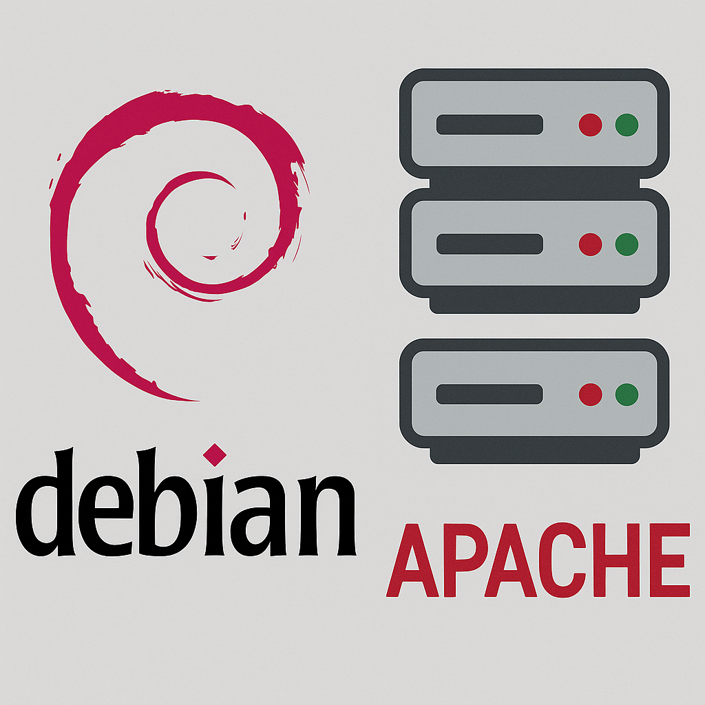

[](https://classroom.github.com/a/vMONzaIj)

# APACHE
## Apache2 on Debian 12



- Automaticke vytvoreni VM Debian 12
- Pridani SSH verejneho klice
- Instalace web serveru apache pomoci  bash scriptu

## Documentation

- [Vagrant - Shell Provisioner](https://developer.hashicorp.com/vagrant/docs/provisioning/shell)
- [Vagrant - File Provisioner](https://developer.hashicorp.com/vagrant/docs/provisioning/file)

## How deploy?

```console
cd srv01
vagrant up
```